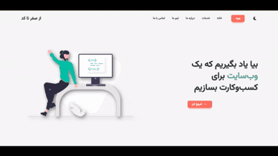

# 🧩 ZeroCode

A modern **landing page** built with **React.js**, **Tailwind CSS**, and **Framer Motion**, created to showcase software development and programming services with a clean and professional design.

## 🌐 Live Demo
[View Demo](https://matinvalizadeh.github.io/zerotocode/)

## 🎬 Demo Video


## 📝 About
**ZeroCode** is a responsive landing page for presenting programming and software development services.  
It focuses on **performance**, **smooth animations**, and **aesthetic visuals**, making it ideal for freelancers, agencies, and startups.

## ✨ Features
- ⚡ Built with React.js and Tailwind CSS  
- 🎞️ Animations powered by Framer Motion  
- 📱 100% responsive layout for all devices  
- 🧭 Page navigation handled by React Router DOM  
- 🎠 Interactive sliders built with Swiper.js  
- 💬 Modern and minimal user interface  

## 🛠 Tech Stack
- React.js  
- Tailwind CSS  
- Framer Motion  
- React Router DOM  
- Swiper.js  

## 🚀 Installation
To run this project locally:

```bash
git clone https://github.com/matinvalizadeh/zerotocode.git
cd zeroCode
npm install
npm start
